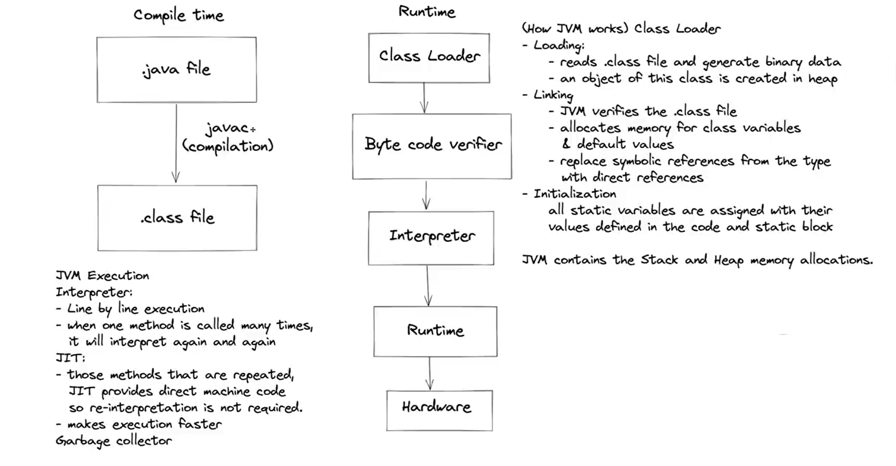

# Day_00[Basics of programming]

## Types of languages & Memory management

### Types of languages

1. Procedural
2. Functional
3. Object oriented

### 1.  Procedural

- Specifies a series of steps & procedures to compose a program.
- Follows systematic order of statements, functions and commands.
- Every programming languages like python, java, C++ , etc.  follows procedural paradigm.

### 2.  Functional

- Function is a block of statements that allows us to reuse the code & to decreases the number of lines of code.
- Writing programs only in pure functions and First class functions.
- A function is called **[pure function](http://en.wikipedia.org/wiki/Pure_function)** if it always returns the same result for same argument values and it has no side effects like modifying an argument (or global variable) or outputting something. Examples are strlen(), pow(), sqrt() etc.
- If a function is known as pure to compiler then **[Loop optimization](http://en.wikipedia.org/wiki/Loop_optimization)** and **[subexpression elimination](http://en.wikipedia.org/wiki/Common_subexpression_elimination)** can be applied to it.
- More about pure functions
[Pure Functions vs Impure Functions in Python - Medium](https://medium.com/@benjamin.BA/pure-functions-vs-impure-functions-in-python-b2f009664ee4)

- Used in ML, to perform different operations on the same dataset
- **First class functions** is of a object type.
- First class functions means where we can assign function to a variable, pass function as a parameter to another function, returns a function from a function and also stores a function in a data structures such as hashset,list, etc.
- More about first class functions
[First Class functions in Python - GeeksforGeeks](https://www.geeksforgeeks.org/first-class-functions-python/)

### 3. Object oriented

- Revolves around objects.
- Code + Data = Object
- Contains class which is a prototype or template of objects.
- we can create various objects from a class with different functionalities(methods).
- Developed to make it easier to develop, debug, reuse and maintain software.
- java ,python & C++ supports oops principles.

### Python supports all three ,where as java supports two of them, except functional.

## Static VS Dynamic

|                               |                Static          |               Dynamic |
| --- | --- | --- |
| Type Checking | done at compile time | done at run time |
| Errors | show at compile time | might not show till program run  |
| Datatype declaration | done before use it | no need to declare |
| control | more control | saves time & might also cause errors |

# Memory management

- Memory management is divided into four segments. They are stack, heap ,data and code.
- Stack segments contains variable names and also allocates memory to activation records or Frames generated in case of recursion technique. Inversed stack is used to grow dynamically.
- Variables names are references stored in stack and are referring to actual object in Heap Segment.
- Heap segment is used to allocate memory dynamically and stores actual objects in memory.
- Buffer exists between Heap and Stack segments which allows both to grow dynamically.
- Data segment divided into two sections i.e., initialized and uninitialized data segments.
- Initialized segment stores all static and global variables.
- Uninitialized segment stores the variables that are not assigned with any value or assigned to 0(Zero).
- Text segment contains the actual code file.

# Flow Charts

Flowchart are used to visualize our thought process step by step using figures/symbols like oval, rectangle, rhombus, parallelogram.

- Start/Stop are represented using Oval.
- Input/Output are represented using parallelogram.
- Processing/Logic are represented using rectangle.
- Conditions are represented using rhombus.

# How java code executes?

## JDK

- Stands for Java Development Kit.
- Provides environment to develop and run the java programs.
- It is a package that includes the following:
- package
    - Development tools- provide Environment
    - JRE - To run the programs
    - A Compiler - javac
    - Archive - jar
    - docs generator - javadoc
    - Interpreter/ Loader

## JRE

- Stands for Java Run time Environment.
- It is a installation package that only provides environment to run the programs.
- It consists the following:
- Package
    - Deployment technologies
    - User interface toolkits
    - Integration libraries
    - Base libraries
    - JVM

## JVM

- Stands for Java Virtual Machine.
- After we get .class file ,the next thing is passing it through JVM.
- JVM contains three sections Class loader, Byte Code Verifier and Just in Time(JIT) Compiler.
- Class loader, which loads all the classes to execute the program.
- Byte Code Verifier is used to check the format of code.
- Some of checks are
    - Variables are initialized before they are used.
    - Method calls match the types of object references.
    - Rules for accessing private data and methods are not violated.
    - Local variable accesses fall within the runtime stack.
    - The run-time stack does not overflow.
    - If any of the above checks fail, the verifier doesn’t allow the class to be loaded.
- Just in Time Compiler converts the loaded byte code into machine code.

→refer below

[Compilation and Execution of a Java Program - GeeksforGeeks](https://www.geeksforgeeks.org/compilation-execution-java-program/)
